# reliable1-shopify-theme
# Reliable-1 Laboratories

## From Wholesale Catalog to Conversion-Focused DTC Shopify Experience

**A custom Shopify build combining research-led CRO, polished brand design, and bespoke ecommerce functionality.**

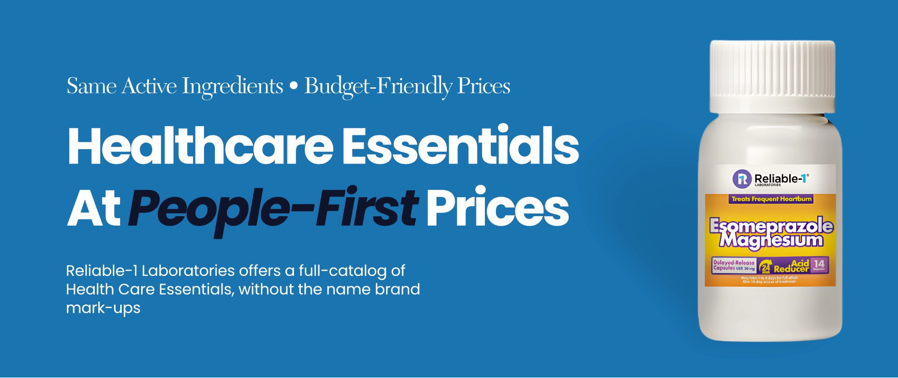

### Live Shopify Preview

**Store:** https://reliable-1-laboratories-vj8b0pje.myshopify.com/  
**Password:** 'nahflo'

> This storefront is maintained as a portfolio/demo environment and has not yet launched as Reliable-1's active DTC sales channel.

| | |
|---|---|
| **Platform** | Shopify |
| **Base Theme** | Dawn |
| **Focus** | CRO, buyer psychology, creative & custom development |
| **Custom Development** | Review-porting system, collection social proof, marketplace integrations & theme modifications |
| **Broader Client Result** | **6.8X increase in daily sales in 23 days*** |

---

# The Opportunity

Reliable-1 Laboratories historically operated primarily as a wholesale business, without an established direct-to-consumer sales channel.

Its existing WordPress site functioned more like a technical catalog than a modern ecommerce experience: a large product assortment, dense technical information, dated presentation, and limited emphasis on the reasons customers actually purchase.

Reliable-1 is also one of Ecom Optimization's longest-standing clients. After helping the brand develop ecommerce into a highly profitable sales channel, we created this Shopify storefront as a forward-looking model for its expansion into DTC.

The objective wasn't simply to move the catalog onto Shopify.

**It was to rethink how Reliable-1 could sell directly to everyday consumers.**

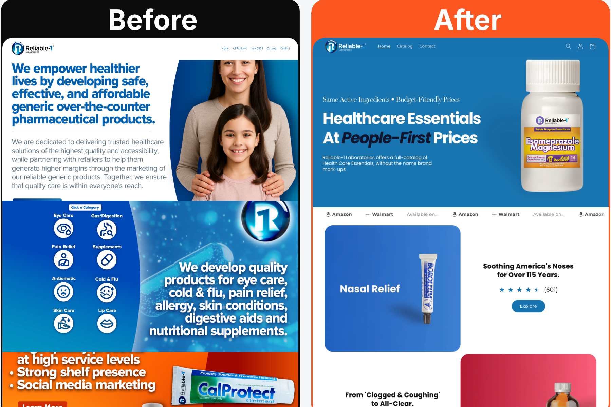

---

# Conversion Starts With the Customer

Reliable-1's DTC positioning was built around a simple idea:

## Quality products without the unnecessary "brand tax."

The intended audience wasn't a wholesale purchasing department or highly technical buyer.

It was everyday families looking for quality health and wellness products without feeling as though they were paying a premium simply for a brand name.

The experience needed to communicate two things simultaneously:

### "They know what they're doing."

The brand needed to convey competence, product knowledge, quality, and trust.

### "They know me."

It also needed to demonstrate an understanding of why the customer was shopping, what they were experiencing, and what they wanted to change.

That combination became the foundation for the design, copy, UX, and conversion architecture.

---

# Research-Led Buyer Psychology

Our conversion work begins with the customer's own language.

We analyze large volumes of reviews across our products, competitors, and adjacent categories looking for recurring patterns in:

- Transformational stories
- Emotional desires
- Frustrations and pain points
- Purchase objections
- Tension and resolution
- Desired outcomes
- The exact language customers use to describe those experiences

The goal isn't to describe a product the way a marketer would.

It's to understand **how customers describe the change they want in their own lives.**

Those insights inform positioning, headlines, image concepts, testimonial selection, page hierarchy, and sales copy.

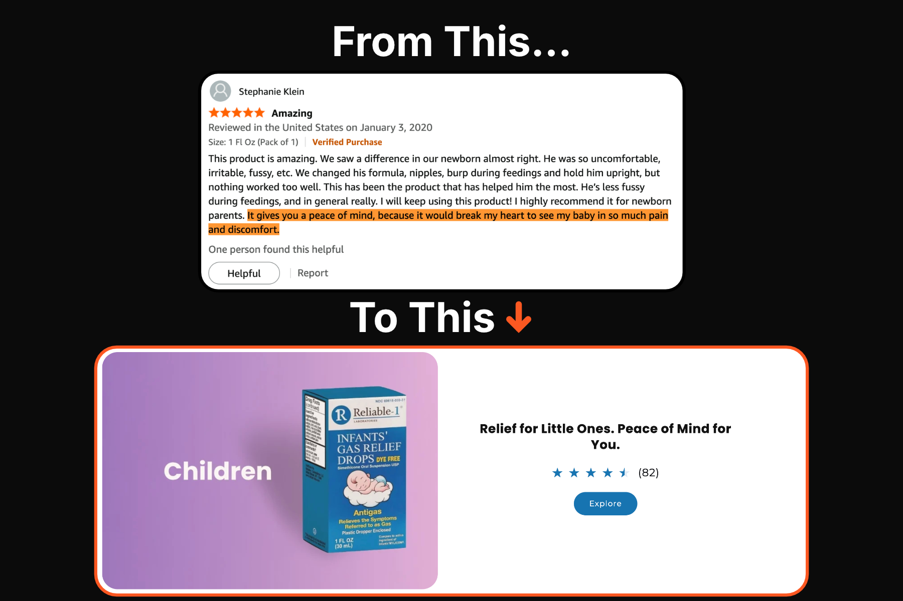

---

# Making a Large Catalog Feel Simple

Reliable-1 has a large and continually expanding catalog.

That made product discovery one of the most important UX challenges.

Rather than using most of the homepage for traditional brand storytelling, we intentionally kept the opening area relatively compact so shoppers could reach product discovery quickly.

The collection-navigation system uses bright, visually distinct category creative to make the assortment easy to scan.

Each category combines:

**Visual identification → Emotional sales hook → Social proof**

The customer can quickly recognize where they need to go while receiving another reason to continue deeper into the shopping journey.

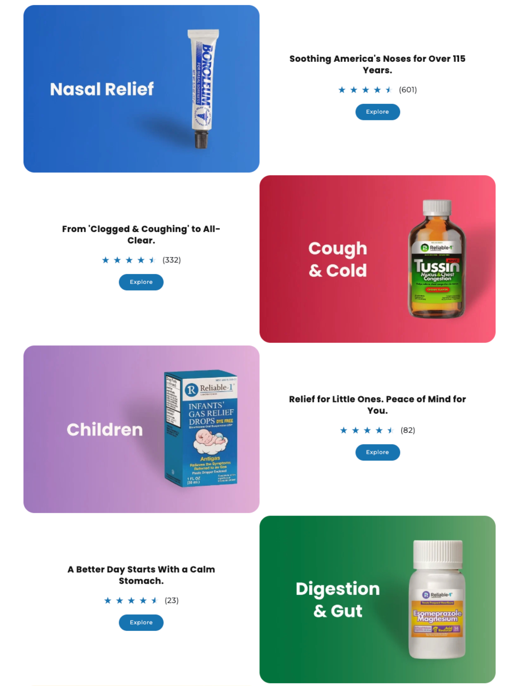

The catalog follows the same principle: reduce the effort required to locate the right product, then reinforce each step with messaging and proof.

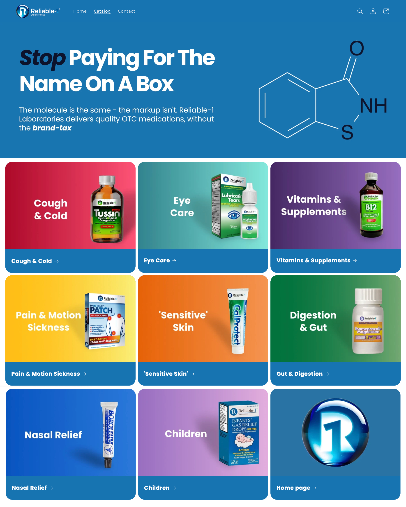

---

# Product Pages Built to Drive Decisions

The PDP is designed around the moments where customer confidence matters most.

## Purchase Information + Proof

Product title, price, ratings, reviews, and purchase controls are kept closely connected so social proof appears at the point where the customer is being asked to commit.

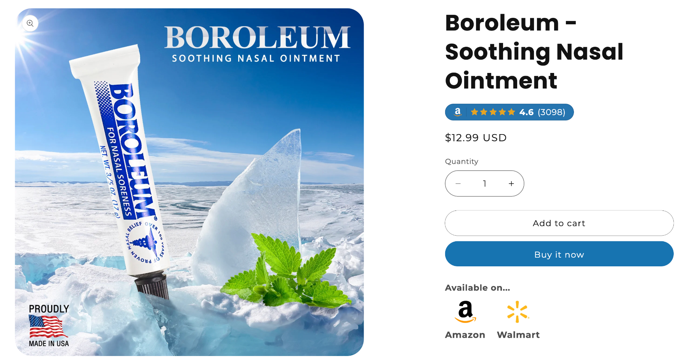

## Copy Built Around Motivation

Product messaging begins with the underlying emotional driver identified through customer research—pain, frustration, reassurance, confidence, convenience, or a desired transformation.

Technical information still matters.

But it supports the buying decision rather than becoming the entire buying experience.

## A Visual Sales Journey

The product image stack is designed to communicate the core argument even when a shopper skims rather than reads.

The creative progressively moves through customer motivation, relevance, benefits, proof, desired outcomes, and reasons to act.

---

# Social Proof Early and Often

For an unfamiliar standalone DTC store, customers often require additional reassurance compared with purchasing through an established marketplace.

We therefore introduce social proof throughout the journey rather than waiting until the bottom of the page.

One of the first major supporting visuals on the PDP pairs a face-to-camera customer image with a deliberately selected review reflecting the same emotional motivations addressed by the surrounding sales copy.

Customers who continue deep into the PDP receive another layer of validation through imported Amazon reviews.

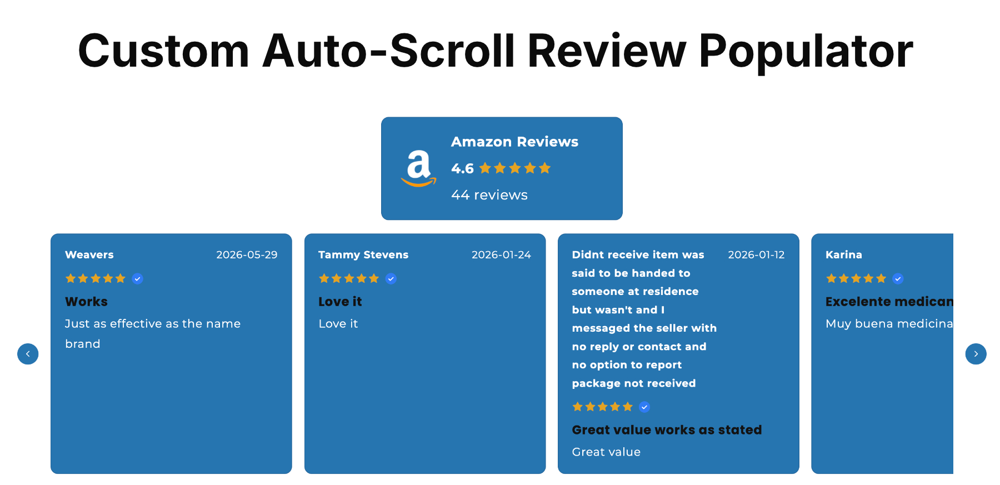

---

# Custom Shopify Development

Reliable-1 was built on Shopify's **Dawn** theme and substantially customized around the conversion strategy.

Rather than allowing the theme to dictate the shopping experience, custom functionality was developed where the customer journey required it.

## Custom Amazon Review Porting System

We developed a custom system for bringing existing Amazon review content into the Shopify environment.

A companion Chrome extension gathers review data from Amazon listings so corresponding social proof can be associated with Shopify products and surfaced throughout the storefront.

The system supports social proof at multiple stages of the funnel, including product pages, collection/category experiences, and dedicated review components.

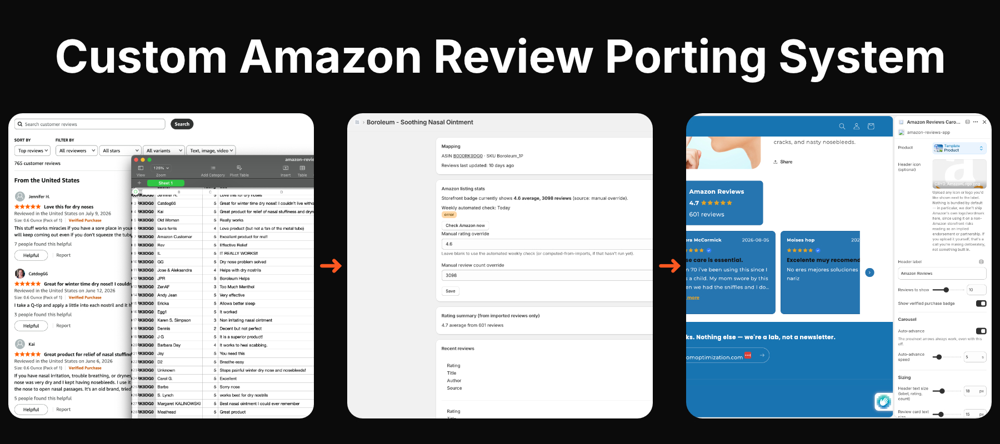

**Technical Repository:** `[ADD REVIEW SYSTEM REPOSITORY LINK WHEN AVAILABLE]`

---

## Collection-Level Social Proof

Custom components allow aggregate social proof to appear higher in the funnel, before a shopper reaches an individual PDP.

This turns category navigation itself into part of the trust-building process.

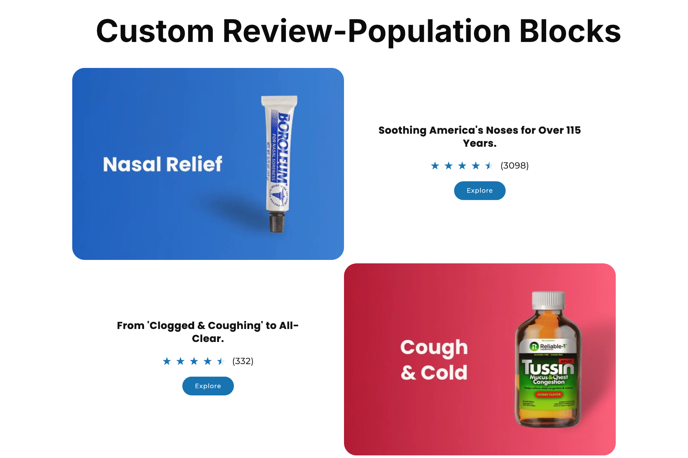

---

## Amazon + Walmart Marketplace Integration

A custom-coded scrolling marquee communicates that Reliable-1 products are also available through Amazon and Walmart.

The component includes continuous scrolling, clickable marketplace destinations, and hover-to-pause interaction so shoppers can stop the marquee and select a destination.

Amazon destinations can also support eligible Brand Referral Bonus tracking.

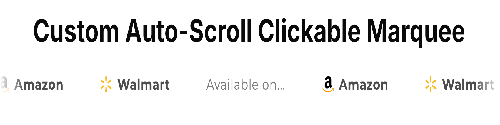

Custom marketplace purchase options also appear directly on relevant PDPs.

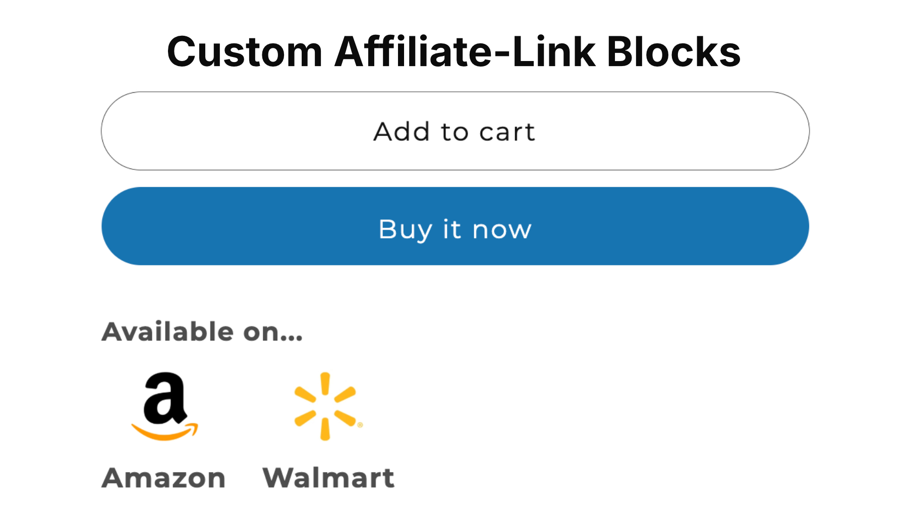

---

# Clean Without Becoming Corporate

Health and wellness design often equates "professional" with muted, sterile, or generic.

We deliberately challenged that assumption.

Reliable-1 needed to communicate credibility and competence while remaining vibrant, human, approachable, and visually memorable.

The storefront uses a disciplined structural foundation paired with bold color, distinctive category creative, and high-attention product imagery.

**Professional shouldn't have to mean dull.**

---

# Designed With Mobile in Mind

Mobile wasn't treated as a cleanup step after desktop design.

Creative assets were developed from the beginning with typography, text placement, image composition, content density, and section flow across smaller screens in mind.

Getting the underlying content hierarchy right reduced the need for excessive mobile-specific workarounds later.

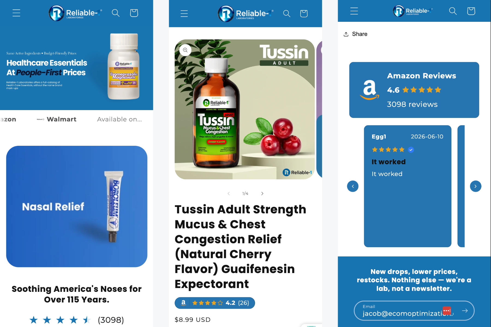

---

# Project Scope

### Strategy & CRO

Buyer/review research · Buyer psychology · Emotional-driver research · Conversion architecture · DTC positioning · Navigation/catalog strategy · Product presentation strategy · Sales copy

### Creative

Creative direction · Homepage and category creative · Product-page image stacks · Testimonial/social-proof creative · Responsive asset design

### Shopify Development

Dawn theme customization · Custom Liquid/theme development · Custom collection presentation · PDP customization · Amazon review-porting system · Chrome extension companion · Collection-level social proof · Review carousel · Amazon/Walmart integrations · Brand Referral Bonus link integration

---

# Broader Ecommerce Results

Reliable-1 is one of Ecom Optimization's longest-standing clients.

Our broader ecommerce and conversion work with the brand produced a:

# 6.8X Increase in Daily Sales in 23 Days

The growth followed work focused on product positioning, information hierarchy, trust development, customer education, and purchase confidence.

Those same conversion principles informed this Shopify build.

> **Performance Attribution:** The 6.8X result reflects Ecom Optimization's broader ecommerce work with Reliable-1. The Shopify storefront shown here has not yet launched as the brand's active DTC sales channel and therefore has no attributed Shopify sales results at this stage.

---

# Technical Stack

**Platform:** Shopify  
**Base Theme:** Dawn  
**Frontend:** Liquid · HTML · CSS · JavaScript  
**Architecture:** Shopify Sections · JSON Templates · Theme Schema  
**Custom Functionality:** Review integration · Chrome extension integration · Marketplace components

<!--
JACOB:
Verify and edit the technical stack based on what is actually present in the repository.

Add anything technically meaningful that has been omitted.
Remove anything that is not accurate.
-->

---

# Featured Code

For developers reviewing the repository, these components are good starting points:

### Amazon Review Integration

`[JACOB — ADD CLICKABLE FILE PATH / LINKS]`

### Collection Social Proof

`[JACOB — ADD CLICKABLE FILE PATH / LINKS]`

### Amazon + Walmart Marquee

`[JACOB — ADD CLICKABLE FILE PATH / LINKS]`

### Marketplace PDP Buttons

`[JACOB — ADD CLICKABLE FILE PATH / LINKS]`

### Custom Collection Presentation

`[JACOB — ADD CLICKABLE FILE PATH / LINKS]`

<!--
JACOB:

Where possible, make each entry a clickable relative GitHub link.

Example:

[`sections/marketplace-marquee.liquid`](sections/marketplace-marquee.liquid)

If a different component is technically more impressive than one listed above, substitute it.
-->

---

# About Ecom Optimization

**Ecom Optimization combines conversion strategy, buyer psychology, creative, and Shopify development to build ecommerce experiences designed around how customers actually make purchase decisions.**

Development determines what an ecommerce experience *can* do.

Conversion strategy determines whether customers care.

---

## Explore the Live Build

**Shopify Preview:**  
https://reliable-1-laboratories-vj8b0pje.myshopify.com/

**Password:** 'nahflo'

\*The 6.8X result reflects our broader ecommerce work where we have taken these principals and applied them all of their ecommerce pat.

<!--
FINAL JACOB CHECKLIST

3. Review exported theme files before making repository public.
Pay particular attention to:
- config/settings_data.json
- App configuration
- API keys/tokens
- Tracking/configuration values
- Private comments
- Client-sensitive information
- Anything that should not be public

4. Verify technical stack.

5. Populate Featured Code with direct relative links to the best files.

6. Confirm Amazon Brand Referral Bonus implementation is described accurately.

7. Verify every /docs image filename and capitalization exactly matches the README.

8. Eventually create the separate Amazon Review Porting System / Chrome Extension repository.

9. Replace the review-system repository placeholder with the public URL.

10. Review the entire public repository while logged out:
- README rendering
- Images
- Live Shopify demo
- Password
- Featured Code links
- No unfinished placeholders
- No sensitive files/data
-->
